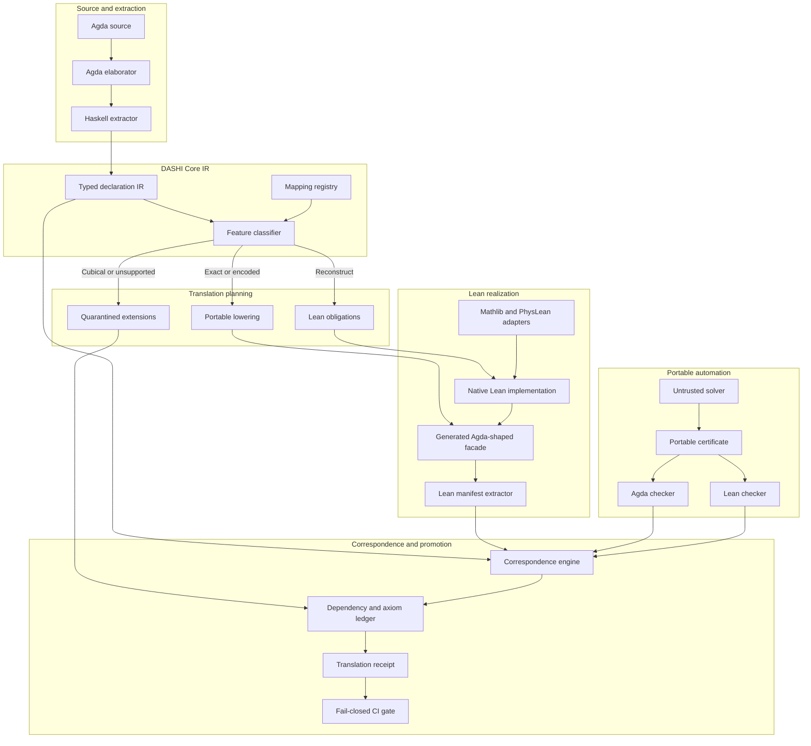

# agda2lean
it's in the name

```mermaid
flowchart TD
    subgraph Source["Source and extraction"]
        AS["Agda source"]
        AE["Agda elaborator"]
        EX["Haskell extractor"]
        AS --> AE --> EX
    end

    subgraph Core["DASHI Core IR"]
        IR["Typed declaration IR"]
        MR["Mapping registry"]
        FP["Feature classifier"]
        EX --> IR
        IR --> FP
        MR --> FP
    end

    subgraph Lowering["Translation planning"]
        EQ["Portable lowering"]
        OB["Lean obligations"]
        QX["Quarantined extensions"]
        FP -->|Exact or encoded| EQ
        FP -->|Reconstruct| OB
        FP -->|Cubical or unsupported| QX
    end

    subgraph LeanSide["Lean realization"]
        LF["Generated Agda-shaped facade"]
        LN["Native Lean implementation"]
        LA["Mathlib and PhysLean adapters"]
        LI["Lean manifest extractor"]
        EQ --> LF
        OB --> LN
        LA --> LN
        LN --> LF
        LF --> LI
    end

    subgraph Certificates["Portable automation"]
        CS["Untrusted solver"]
        CP["Portable certificate"]
        AC["Agda checker"]
        LC["Lean checker"]
        CS --> CP
        CP --> AC
        CP --> LC
    end

    subgraph Verification["Correspondence and promotion"]
        CE["Correspondence engine"]
        DL["Dependency and axiom ledger"]
        RC["Translation receipt"]
        CI["Fail-closed CI gate"]
        IR --> CE
        LI --> CE
        AC --> CE
        LC --> CE
        QX --> DL
        CE --> DL --> RC --> CI
    end

```
