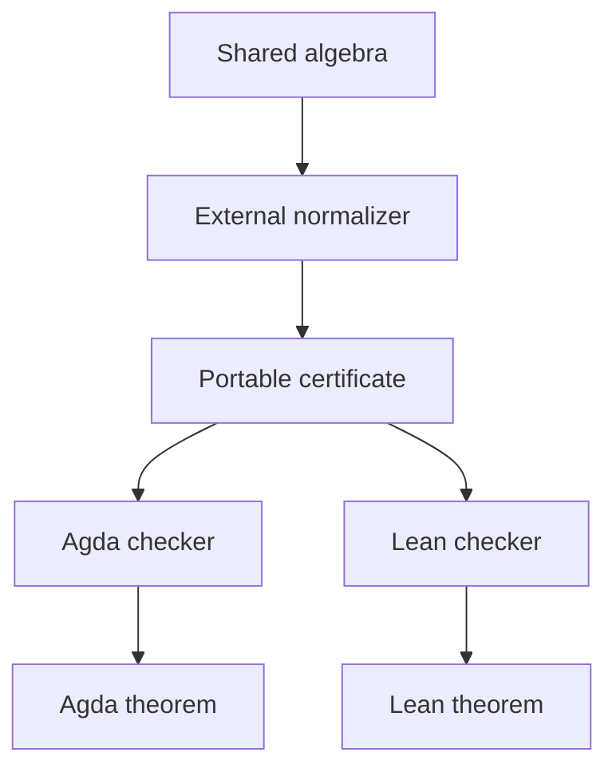
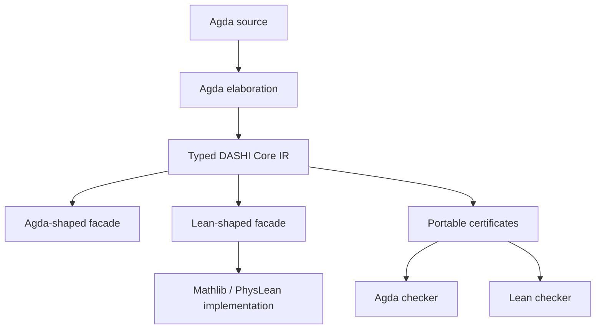
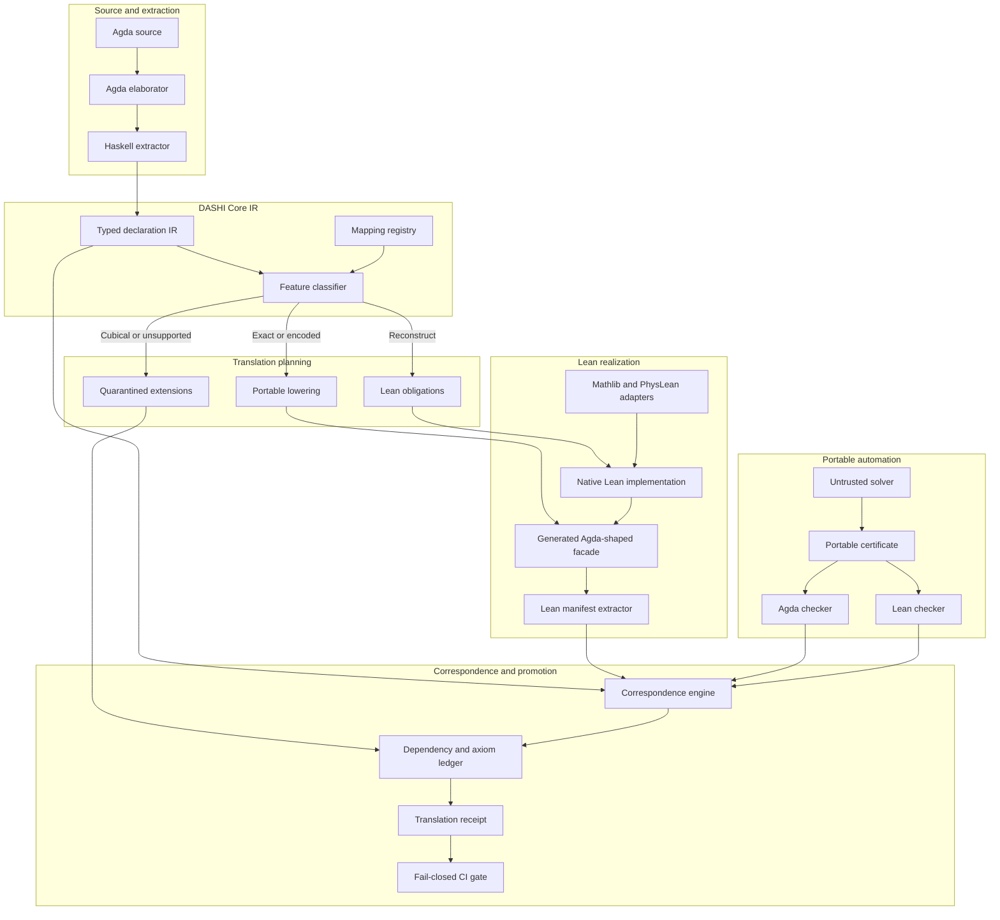
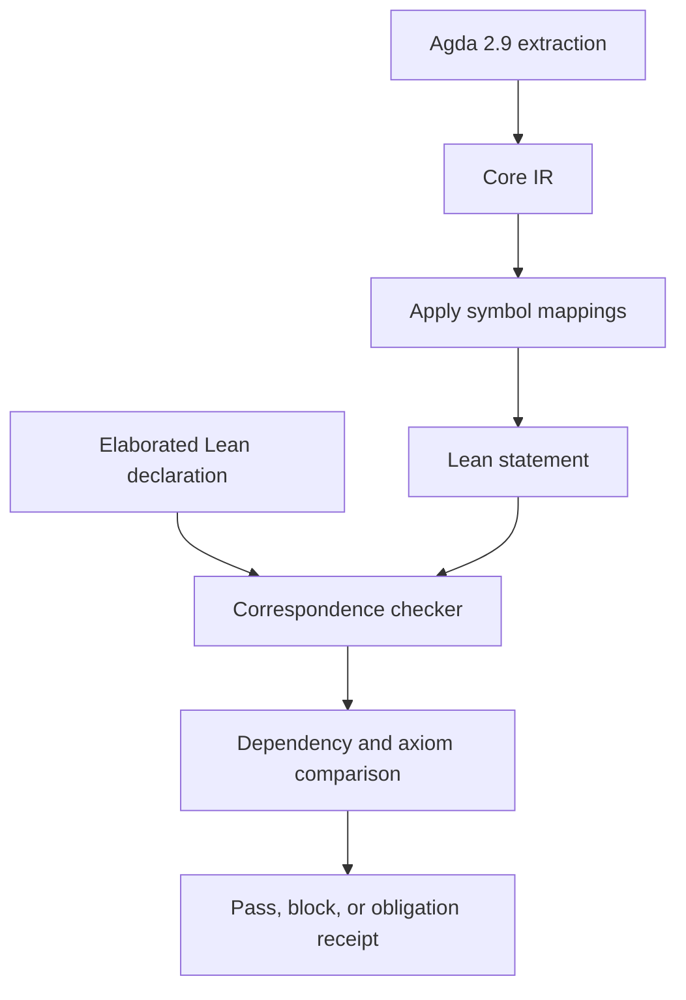
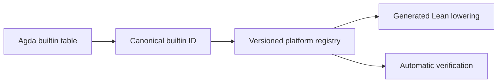

# agda2lean

`agda2lean` is a proof-aware translation pipeline for producing recognisable,
native Lean counterparts of elaborated Agda declarations while preserving
their statements, dependency boundaries and required computational behaviour.

The implementation is intentionally not a text-to-text converter:

```text
Agda elaboration
    -> strict typed Core IR
    -> canonical CBOR
    -> SQLite catalog
    -> Lean facade and reconstruction obligations
    -> independent Lean validation
```

## Current implementation

The first two vertical tranches provide:

- a strict typed Core IR;
- a deterministic canonical CBOR codec;
- SHA-256 content addressing;
- a transactional SQLite/WAL catalog;
- normalized declaration and direct-dependency indexes;
- CLI initialization, ingestion, extraction, inspection and verification;
- an exact-revision Agda 2.9 compiler backend that consumes typechecked internal syntax;
- a version-independent elaboration snapshot and de Bruijn-safe DAG extractor;
- direct-dependency and feature discovery from elaborated terms;
- Agda 2.9 `@rewrite` and Cubical boundary detection;
- an Agda-shaped Lean facade emitter with escaped original names;
- a versioned platform builtin registry, with active Agda builtin names
  lowered to language-neutral IR identities;
- explicit reconstruction diagnostics and a fail-closed emission mode;
- a pinned DASHI Agda/Lean mirror registry and parallel Moonshine smoke test;
- round-trip, determinism, deduplication and corruption tests.

JSON is deliberately absent from the authoritative path. SQLite is the
queryable operational store, CBOR is the semantic encoding, and CLI reports are
the human inspection surface.


## Diagrams













## Commands

```bash
cabal build all
cabal test all

# Build the exact-revision Agda 2.9 backend.
cabal --project-file=cabal.project.agda-2.9 build \
  -fagda-backend agda2lean-agda

# Typecheck a real Agda module and emit canonical IR under build/ir/.
cabal --project-file=cabal.project.agda-2.9 run \
  -fagda-backend agda2lean-agda -- \
  -j2 --lean-ir --compile-dir build/ir path/to/Module.agda

# Compare a second Agda target against the Dashi Lean mirror.
scripts/check-monsterstate-correspondence.sh

cabal run agda2lean -- init --database build/catalog.sqlite
cabal run agda2lean -- put-module \
  --database build/catalog.sqlite \
  --input module.cbor
cabal run agda2lean -- inspect --database build/catalog.sqlite
cabal run agda2lean -- verify --database build/catalog.sqlite

cabal run agda2lean -- emit-lean \
  --input build/ir/Module/module.a2l.cbor \
  --lean-output build/lean/Module.lean \
  --diagnostics build/lean/Module.diagnostics.tsv

# Deprecated spelling retained as a no-op; emission is already fail-closed.
cabal run agda2lean -- emit-lean \
  --input build/ir/Module/module.a2l.cbor \
  --lean-output build/lean/Module.lean \
  --diagnostics build/lean/Module.diagnostics.tsv \
  --fail-on-reconstruction
```

The pinned Agda backend check is intentionally expensive on a cold cache because Cabal builds the audited Agda 2.9 source dependency tree before it runs `Identity.agda`. In this environment the end-to-end `scripts/check-agda-backend.sh` smoke test took about 17 minutes.

### Translate a project closure

The project driver computes a transitive import closure, schedules independent
modules at dependency-DAG frontiers, and writes a self-contained Lean 4.28 Lake
workspace. Agda interfaces live in a writable cache keyed by the Agda/backend
toolchain and the complete source closure; source checkouts are not modified.

```sh
backend="$(scripts/cabal-agda-2.9.sh list-bin --flag agda-backend exe:agda2lean-agda)"
emitter="$(scripts/cabal-agda-2.9.sh list-bin --flag agda-backend exe:agda2lean)"

scripts/a2l_project.py plan \
  --source-root path/to/agda/project \
  --entry My.Project.Root

scripts/a2l_project.py build \
  --source-root path/to/agda/project \
  --entry My.Project.Root \
  --backend "$backend" \
  --emitter "$emitter" \
  --workspace build/generated-project \
  --cache-root build/cache \
  --jobs 4 \
  --lake lake
```

`--jobs` bounds the number of independent Agda processes. Each process uses
`-j1`, avoiding nested parallelism and the memory spikes that otherwise become
severe on large libraries. Re-running an unchanged closure reuses its isolated
Agda interfaces and IR.

Emission is fail-closed by default. The deprecated
`--fail-on-reconstruction` spelling is accepted as a no-op for old scripts;
only the explicit `--allow-reconstruction` testing option permits legacy
`sorry`-backed reconstruction.

The strict first proof-producing gate is:

```sh
bash scripts/check-jfixedpoint.sh
```

It regenerates twice, builds under Lean 4.28, checks every original public
declaration, rejects all generated axioms and `sorry`, and asks the kernel to
reduce `contract-all tower-3` to `[196884, 196884, 196884]`.

`put-module` validates and re-encodes the supplied object before storing it, so
non-canonical or trailing input cannot acquire an authoritative object hash.

The DASHI mirror fixtures pin both repositories by commit. CI checks independent
fixtures in separate jobs; Agda's own import elaboration is bounded at `-j2` to
avoid exchanging a modest speedup for unbounded peak memory.
`fixtures/dashi-mirrors.toml` is the reviewed source of theorem/name mappings
and expected fidelity blocks. `lean/Agda2Lean/Manifest.lean` emits deterministic
direct type/value references and transitive Lean axiom closures for the next
comparison tranche.

See [PLANNING.md](PLANNING.md), [ROADMAP.md](ROADMAP.md),
[ADR 0001](docs/adr/0001-storage-and-canonical-encoding.md), and
[ADR 0002](docs/adr/0002-elaborated-extraction-and-lean-facades.md).

Related implementations:

- [lean2agda](https://github.com/lyphyser/lean2agda)
- [Agda](https://github.com/agda/agda)
- [Lean 4](https://github.com/leanprover/lean4)
