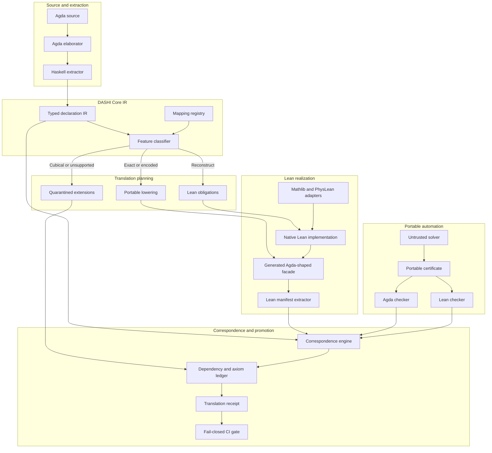
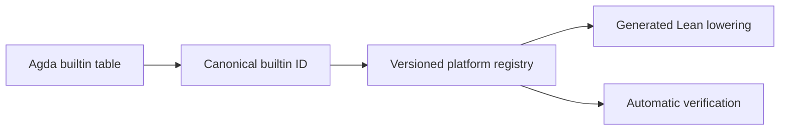

The strongest architecture is a **proof-producing, typed IR pipeline with native implementations on both sides**. The IR coordinates meaning and dependencies; it is not itself trusted. Agda and Lean independently kernel-check the resulting declarations.

## Implementation status

The first Phase 0/1 tranche is now implemented:

- strict typed Haskell Core IR represented as a term DAG;
- deterministic versioned canonical CBOR codec;
- SHA-256 semantic object identities;
- SQLite catalog in WAL mode with immutable objects and module heads;
- normalized declaration, import and direct-dependency indexes;
- CLI initialization, ingestion, extraction, inspection and verification;
- codec determinism, round-trip, deduplication and corruption tests.

JSON is not used as an authoritative format. Human inspection is through
stable CLI reports; machine access is through SQLite queries and canonical
CBOR.

The second compiler-facing tranche is also implemented:

- a custom, exact-revision Agda 2.9 backend over `Agda.Compiler.Backend`;
- extraction from typechecked internal terms rather than concrete source text;
- a stable, version-independent elaboration snapshot;
- de Bruijn validation, term interning, dependency discovery and feature
  classification;
- recognition of ordinary Agda builtin equality without treating Cubical paths
  as Lean equality;
- preservation of `Set`, `Prop` and `SSet` universe distinctions in the IR;
- module-by-module Lean facade generation;
- stable escaping that keeps Unicode and mixfix Agda names identifiable;
- explicit reconstruction/axiom diagnostics and fail-closed emission.

The next tranche is the mapping registry plus native Lean reconstruction
adapters. It will replace selected generated axioms/sorries with Mathlib-aware
proofs and then compare Lean's elaborated constant dependencies with the IR
boundary.

## Architecture



The central invariant is:

[
\boxed{
\text{same statement}
+
\text{same dependency boundary}
+
\text{appropriate computational correspondence}
}
]

The Agda and Lean proof terms may differ completely.

## 1. Source-of-truth model

Initially:

[
\text{Agda source}
\longrightarrow
\text{canonical IR}
\longrightarrow
\text{Lean facade and obligations}.
]

Agda remains the source of existing declarations. The IR is the canonical translation record, but we do not manually write proofs in it.

Lean consists of two layers:

1. **Agda-shaped public facade**

   Preserves paths, names, parameter order, record fields and theorem structure.

2. **Native Lean implementation**

   Uses Mathlib, PhysLean and idiomatic Lean proofs.

For example:

```lean
-- Generated/mirrored public surface
theorem boundaryGaugeFixedHodgePoincare
    (index : Index)
    (h : Tangent index)
    (hr : regime index = .boundary)
    (hg : GaugeFixedTangent index h) :
    cBoundary * normSq index h ≤ referenceEnergy index h :=
  Native.Hodge.boundaryCoercivity index h hr hg
```

The facade resembles Agda; the implementation need not.

## 2. DASHI Core IR

The IR should represent elaborated declarations rather than source syntax.

### Declaration information

```text
CoreDeclaration
  schemaVersion
  canonicalName
  declarationRole
  universeParameters
  moduleParameters
  localBinders
  type
  body or equations
  constructors or fields
  terminationInformation
  reducibility
  directDependencies
  sourceLocation
  featureRequirements
```

### Term language

The portable core needs:

* variables and constants;
* universes;
* dependent functions (\Pi);
* dependent pairs (\Sigma);
* lambdas and applications;
* inductive types and constructors;
* records and projections;
* eliminators;
* ordinary equality;
* structural and well-founded recursion;
* explicit axioms and postulates;
* opacity and reducibility.

### Declaration roles

Every declaration must be classified as:

```text
computational-data
computational-function
computational-witness
logical-proposition
theorem
axiom
certificate
adapter
```

This prevents an Agda proof-relevant `Set` from being incorrectly emitted into Lean’s proof-irrelevant `Prop`.

## 3. Mapping registry

Mappings should be data, not scattered emitter special cases.

A mapping entry records:

```text
source construction
target construction
mapping mode
required adapter
semantic correspondence
dependency effect
computational effect
```

The four principal modes are:

[
\mathsf{Exact}
\mid
\mathsf{Encoded}
\mid
\mathsf{Reconstruct}
\mid
\mathsf{Unsupported}.
]

Examples:

| Source                       | Target                           | Mode        |
| ---------------------------- | -------------------------------- | ----------- |
| Ordinary Agda record         | Lean structure                   | Exact       |
| Parameterized module         | Namespace plus context           | Encoded     |
| Proof-relevant `Set` witness | Lean structure/subtype in `Type` | Exact       |
| Algebra theorem              | Native Mathlib theorem           | Reconstruct |
| Ordinary path fragment       | Lean `Eq`                        | Encoded     |
| Cubical univalence           | Model or explicit axiom          | Quarantined |
| Arbitrary rewrite rule       | `simp` theorem or reconstruction | Reconstruct |
| Unsupported kernel behaviour | No emission                      | Unsupported |

## 4. Extension handling

The portable IR should not pretend to contain all Cubical Agda.

Use explicit extension nodes:

```text
Core.Extension.Cubical
Core.Extension.Rewrite
Core.Extension.Coinductive
Core.Extension.UnsafeUniverse
```

Cubical lowering then returns one of:

```text
ordinary-equality
explicit-quotient
native-reconstruction
semantic-model
axiom-quarantine
unsupported
```

The authoritative preference order is:

[
\text{native reconstruction}

>

\text{ordinary equality lowering}

>

\text{proved semantic model}

>

\text{explicit axiom}

>

\text{unsupported}.
]

Axiom-based Cubical compatibility may assist porting, but its dependencies must remain visibly quarantined from Clay-facing promotion routes.

## 5. Lean facade generation

The emitter should preserve:

* relative module paths;
* declaration names;
* constructors and fields;
* argument order;
* declaration order;
* documentation;
* source locations;
* mapping status.

Suggested layout:

```text
DASHI/Algebra/Trit.agda
DASHILean/DASHI/Algebra/Trit.lean

DASHI/Physics/NSPeriodicWallIHarmonicCompletion.agda
DASHILean/DASHI/Physics/NSPeriodicWallIHarmonicCompletion.lean
```

Generated comments can identify correspondence without making the code unreadable:

```lean
/--
Source: DASHI.Physics.NSPeriodicWallIHarmonicCompletion
Statement: exact
Proof: native reconstruction
Dependencies: closed
-/
```

Generated facades should be deterministic and disposable. Handwritten Lean proofs belong under `Native/`, where regeneration cannot overwrite them.

## 6. Native Lean layer

Suggested structure:

```text
DASHILean/
  DASHI/
    Compat/
      Equality.lean
      Dependent.lean
      ModuleContext.lean
      CubicalPathFragment.lean
      CubicalAxioms.lean

    Automation/
      Algebra.lean
      FiniteFold.lean
      Certificate.lean
      DependencyAudit.lean

    Native/
      Foundations/
      Algebra/
      Analysis/
      NavierStokes/
      YangMills/

    Facade/
      Foundations/
      Algebra/
      Analysis/
      NavierStokes/
      YangMills/
```

`Compat/CubicalAxioms.lean` should never be imported indirectly. Any import must appear in the dependency ledger.

## 7. Portable certificate system

Solvers should be untrusted certificate producers.

The first certificate families should cover:

* associativity and commutativity;
* semiring/ring normalization;
* rational arithmetic;
* finite sums and products;
* literal list folds;
* finite enumerator cardinality;
* shell-index arithmetic;
* scalar inequalities.

For input (e), the solver returns a certificate (C):

[
\mathsf{solve}(e)=C.
]

Agda and Lean independently check it:

[
\mathsf{check}_A(e,C)=\mathsf{true},
\qquad
\mathsf{check}_L(e,C)=\mathsf{true}.
]

This allows one solver implementation while preserving both kernels as the trust boundary.

## 8. Lean manifest extraction

After Lean compiles the generated facade and native implementation, a Lean program should inspect the environment and export:

* fully elaborated target types;
* universe parameters;
* implicit and instance binders;
* constants actually referenced;
* axioms consumed;
* reducibility;
* declaration kind;
* presence of `sorryAx`.

The correspondence engine compares this output against the source IR. We therefore validate what Lean accepted, not merely what the Haskell emitter intended to generate.

## 9. Correspondence levels

Every declaration receives:

[
\operatorname{Status}(d)
========================

(S,D,C,A).
]

Where:

* (S): statement correspondence;
* (D): dependency correspondence;
* (C): computation correspondence;
* (A): axiom status.

Possible values include:

```text
exact
bridged
extensionally-proved
certificate-checked
reconstructed
quarantined
unresolved
unsupported
```

Example theorem:

```text
statement:    exact
dependencies: exact
computation:  not-required
axioms:       none
```

Example executable enumerator:

```text
statement:    exact
dependencies: exact
computation:  extensionally-proved
certificate: checked-by-both
axioms:       none
```

Example Cubical staging port:

```text
statement:    bridged
dependencies: cubical-extension
computation:  unavailable
axioms:       univalence
promotion:    prohibited
```

## 10. CI promotion gate

A declaration becomes dependency-closed only if:

[
\begin{aligned}
&\mathsf{AgdaChecked}(d_A),\
&\mathsf{LeanChecked}(d_L),\
&\mathsf{StatementAligned}(d_A,d_L),\
&\mathsf{DependenciesResolved}(d_A,d_L),\
&\neg\mathsf{UnexpectedAxiom}(d_L),\
&\neg\mathsf{Sorry}(d_L),\
&\mathsf{RequiredComputationAligned}(d_A,d_L).
\end{aligned}
]

The generated receipt should be machine-readable and human-readable.

---

# Deliverables

## Phase 0 — Architecture and specification

1. **Architecture decision record**

   * Haskell as primary translation implementation.
   * Lean 4 and Agda as native verification layers.
   * Explicit trust model.

2. **DASHI Core IR specification**

   * Binder and scope model.
   * Universe representation.
   * Declaration roles.
   * Equality and recursion representation.
   * Dependency semantics.
   * Extension mechanism.

3. **Canonical serialization specification**

   * Versioned canonical CBOR.
   * SQLite/WAL operational catalog.
   * Content-addressed immutable module objects.
   * Stable qualified names and binder IDs.
   * Semantic hashes.
   * Deterministic key and declaration ordering.

4. **Mapping policy**

   * Exact/encoded/reconstruct/unsupported definitions.
   * Statement, dependency and computation acceptance rules.
   * Cubical quarantine policy.

## Phase 1 — Minimal working vertical slice

5. **`dashi-core-ir` Haskell package**

   * Typed AST.
   * Scope validation.
   * Dependency graph.
   * Canonical encoder/decoder.
   * Semantic hashing.

6. **Pinned Agda extractor**

   * Agda backend using elaborated internal syntax.
   * Extract declarations by module or qualified name.
   * Capture module parameters, implicits, definitions and postulates.

7. **Feature classifier**

   * Ordinary portable core.
   * Cubical use.
   * rewrite pragmas;
   * coinduction/copatterns;
   * unsafe universes;
   * termination-sensitive definitions.

8. **Initial Lean facade emitter**

   * Data/inductive declarations.
   * Records/structures.
   * functions;
   * theorem signatures;
   * namespace and module lowering;
   * source correspondence comments.

9. **Twenty-declaration pilot**

   * finite carrier;
   * indexed datatype;
   * record;
   * proof-relevant witness;
   * ordinary equality theorem;
   * structural recursion;
   * finite fold;
   * algebraic assembly theorem;
   * parameterized module;
   * explicit analytic assumption package.

## Phase 2 — Lean native integration

10. **`DASHI.Compat` Lean library**

    * dependent-pair and transport helpers;
    * context/module adapters;
    * record extensionality;
    * ordinary path compatibility;
    * explicit Cubical quarantine module.

11. **`DASHI.Automation` Lean library**

    * Agda-facing wrapper tactics;
    * algebraic normalization;
    * finite fold simplification;
    * dependency audit commands.

12. **Mathlib alignment registry**

    * source DASHI symbol;
    * target Mathlib symbol;
    * adapter theorem;
    * variance and convention notes.

13. **PhysLean alignment registry**

    * Fourier carriers;
    * norms and inner products;
    * finite sums/integrals;
    * PDE and physics structures where available.

14. **Native implementation modules**

    * handwritten Lean proofs;
    * no generated proof bodies;
    * facades delegate to native theorems.

## Phase 3 — Verification

15. **Lean environment manifest exporter**

    * elaborated declarations;
    * actual constants consumed;
    * universes and binders;
    * axiom usage;
    * `sorryAx` detection.

16. **Correspondence engine**

    * source/target statement comparison;
    * symbol alignment;
    * dependency-closure comparison;
    * computation obligation generation.

17. **Translation receipt format**

    * per-declaration status tuple;
    * source and target hashes;
    * dependency mapping;
    * unresolved obligations;
    * promotion status.

18. **Logical-relation generator**

    * primitive carriers;
    * products and records;
    * functions;
    * propositions;
    * finite containers;
    * executable definitions.

## Phase 4 — Portable solvers

19. **Certificate schema**

    * expression grammar;
    * normalization steps;
    * source expression hash;
    * result normal form;
    * checker version.

20. **Initial certificate producer**

    * associativity;
    * commutativity;
    * rational arithmetic;
    * semiring/ring expressions.

21. **Agda certificate checker**

22. **Lean certificate checker**

23. **Checker correctness theorems**

    * accepted certificate implies represented equality;
    * malformed certificates fail closed.

24. **DASHI finite-certificate expansion**

    * literal folds;
    * enumerator lengths;
    * shell arithmetic;
    * scalar bounds;
    * boundary matrices.

## Phase 5 — Cubical and exceptional features

25. **Actual Cubical usage audit**

    * declaration-level dependency graph;
    * distinguish superficial import from consumed primitive;
    * identify ordinary equality-lowerable cases.

26. **Ordinary path lowering**

    * `Path` fragment to Lean `Eq`;
    * transport/congruence/extensionality adapters;
    * correspondence proofs.

27. **Cubical semantic decision**

    * select per declaration:

      * eliminate;
      * reconstruct;
      * model;
      * axiomatize;
      * reject.

28. **Quarantined Cubical package**

    * explicit imports;
    * explicit axiom ledger;
    * hard prohibition from promoted theorem routes.

29. **Optional semantic model prototype**

    * only if genuinely required by important DASHI declarations.

## Phase 6 — Production and CI

30. **`dashi-port` CLI**

```text
dashi-port extract
dashi-port classify
dashi-port emit-lean
dashi-port compare
dashi-port certify
dashi-port audit
dashi-port report
```

31. **Deterministic regeneration check**

    * regenerated IR and facades must match committed output.

32. **Agda validation job**

33. **Lean validation job**

34. **Cross-language correspondence job**

35. **Axiom and `sorry` audit job**

36. **Dependency-drift job**

    * detect newly introduced assumptions or library dependencies.

37. **Certificate replay job**

    * replay every committed certificate in both systems.

38. **Human-readable port dashboard**

    * exact;
    * reconstructed;
    * dependency-closed;
    * computationally aligned;
    * quarantined;
    * unresolved.

## First release criterion

The first meaningful release should not claim arbitrary Agda→Lean translation. It should demonstrate one closed vertical tranche satisfying:

[
\boxed{
\begin{aligned}
&20+\text{ representative declarations},\
&\text{matching Agda and Lean public surfaces},\
&\text{no Lean sorry},\
&\text{no unexpected axioms},\
&\text{exact dependency receipts},\
&\text{proved or certificate-checked computation where required},\
&\text{deterministic regeneration}.
\end{aligned}
}
]

That tranche would validate the architecture before expanding into the large NS/YM theorem graphs or committing to a full Cubical model.
Yes—for the first Moonshine pilot, hardcoding `Moonshine.observer` is acceptable as a temporary, explicit fixture rule. It should not remain an emitter-wide semantic exception.

There are three different kinds of “hardcoding”:

* Good permanent mapping:
  `Agda.Builtin.Nat.Nat ↦ Nat`.
* Acceptable fixture mapping:
  `Moonshine.observer ↦ AgdaMirror.Moonshine.observer`.
* Dangerous exception:
  “Whenever `Moonshine.observer` appears, ignore it during comparison.”

The second form belongs in the versioned fixture/mapping registry:

```toml
[[fixture.mapping]]
from = "Moonshine.observer"
to = "AgdaMirror.Moonshine.observer"
kind = "semantic"
```

The comparator should then verify that mapping rather than assume it. Because both definitions are transparent, it can also normalize their bodies and confirm both reduce to `1`.

It should not be embedded in general Haskell or shell logic such as:

```bash
grep -v 'Moonshine.observer'
```

That could hide a real mismatch if one side later changed `observer` to `2`.

So the intended progression is:

1. Hardcode the pilot pairing explicitly.
2. Move it into `dashi-mirrors.toml`.
3. Verify the paired definition bodies or a Lean kernel bridge.
4. Make the comparison runner generic over registry entries.
5. Remove every Moonshine-specific name from shared comparator code.

The fixture is allowed to say which declarations correspond. It is not allowed to dictate that mismatches between them should be ignored.


We should not hand-code builtin behaviour repeatedly in the emitter. But a small, curated cross-language mapping table is necessary: no evaluator can safely infer that Agda’s natural numbers are intended to become Lean’s native `Nat` merely from structural similarity.

The right model is hybrid:



## What is automatic

The Agda backend should query Agda’s elaborated builtin environment to determine that a particular qualified name is the active natural-number type, equality type, zero constructor, successor, and so forth.

Occurrences then become canonical IR primitives:

```text
Builtin.Nat
Builtin.Nat.zero
Builtin.Nat.suc
Builtin.Nat.add
Builtin.Equality
Builtin.Equality.refl
```

This avoids depending primarily on source spellings such as `Agda.Builtin.Nat.Nat`. Agda can bind builtins through pragmas or library modules, so semantic builtin identity is stronger than matching strings.

The emitter then consults a registry and automatically produces:

```text
Builtin.Nat          ↦ Nat
Builtin.Nat.zero     ↦ Nat.zero
Builtin.Nat.suc      ↦ Nat.succ
Builtin.Nat.add      ↦ Nat.add
Builtin.Equality     ↦ Eq
Builtin.Equality.refl ↦ Eq.refl
```

Every occurrence is lowered programmatically. We do not manually annotate every translated file.

## What must be curated

The choice of native Lean equivalent is a semantic decision and should be written once in a versioned platform registry:

```toml
[[platform-mapping]]
source-builtin = "nat"
source-audit-name = "Agda.Builtin.Nat.Nat"
target = "Nat"
mode = "exact-inductive"
axiom-effect = "none"

[[platform-mapping]]
source-builtin = "identity"
source-audit-name = "Agda.Builtin.Equality._≡_"
target = "Eq"
mode = "ordinary-equality"
axiom-effect = "none"
```

The source spelling is useful for diagnostics and version auditing, but the builtin identity selects the mapping.

There should be separate registries:

* Platform mappings: `Nat`, `Bool`, `List`, ordinary equality, universes.
* Library mappings: Agda standard library → Mathlib/PhysLean.
* Project mappings: DASHI declarations such as `Moonshine.observer`.
* Fixture pairings: which particular Agda and Lean declarations should be compared.

## What gets verified automatically

Each permanent mapping should carry computation obligations. For natural numbers:

[
0_A \leftrightarrow 0_L,\qquad
\operatorname{suc}_A \leftrightarrow \operatorname{succ}_L,
]

[
\operatorname{add}_A(0,n)\leftrightarrow
\operatorname{add}_L(0,n),
]

[
\operatorname{add}_A(\operatorname{suc}(m),n)
\leftrightarrow
\operatorname{add}_L(\operatorname{succ}(m),n).
]

Agda and Lean independently check their corresponding laws. The receipt records that both sides implement the same constructor and reduction signature.

For finite computations, we can additionally evaluate representative normalized expressions on both sides. Later, portable certificates or logical relations provide stronger verification.

## What we should avoid

We should remove emitter logic like:

```haskell
if name == "Agda.Builtin.Nat.Nat"
  then "Nat"
```

and replace it with:

```haskell
resolveBuiltin sourceName
  >>= lookupPlatformMapping
  >>= lowerMappedPrimitive
```

Likewise, generated shims should come from the mapping/compatibility layer rather than bespoke emitter branches.

So the short answer is: we hand-author the small semantic dictionary once, because that choice cannot safely be inferred. Identification, lowering, adapter generation, occurrence handling and verification should all be automatic.
